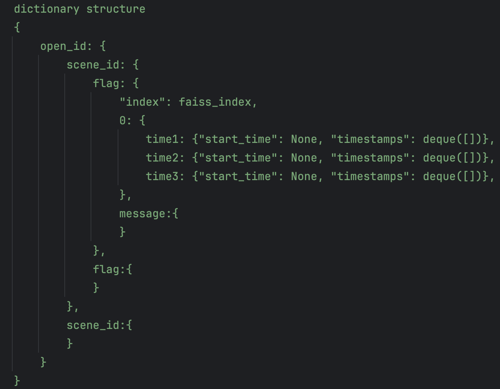
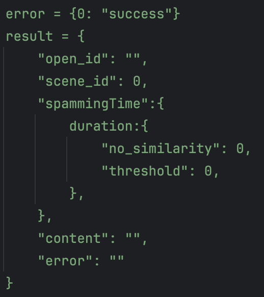

Table of Contents</u>

- [Player-Based-Dynamic-Spam-Filter](#Player-Based-Dynamic-Spam-Filter)
  * [Built with](#built-with)
  * [Screenshot](#screenshot)

# Player Based Dynamic Spam Filter

This is a automation aim to learn:

- Introduction 3 different dynamic duration 
- Different advanced and reduce time complexity data structure 
- bge-m3 model: text embeddings

A simple dynamic sliding window system that capture the player comment data from different scene. Functions includes add store data, sliding window checking, message similarity comparison, delete the old data.

## Built with

- Python
- <a href="https://huggingface.co/BAAI/bge-m3/">Bge-m3 Model</a>

## Screenshot

- **Dictionary Structure**

  - Description: This dictionary store all the data including player id, scene id, messages, message time and the text embeddings. 

  - 

    
- **Output Structure**

  - Description: This is a Json output that showing the number of similairity messages within specific duration. 

  - 

## Author

- Warren Wong
